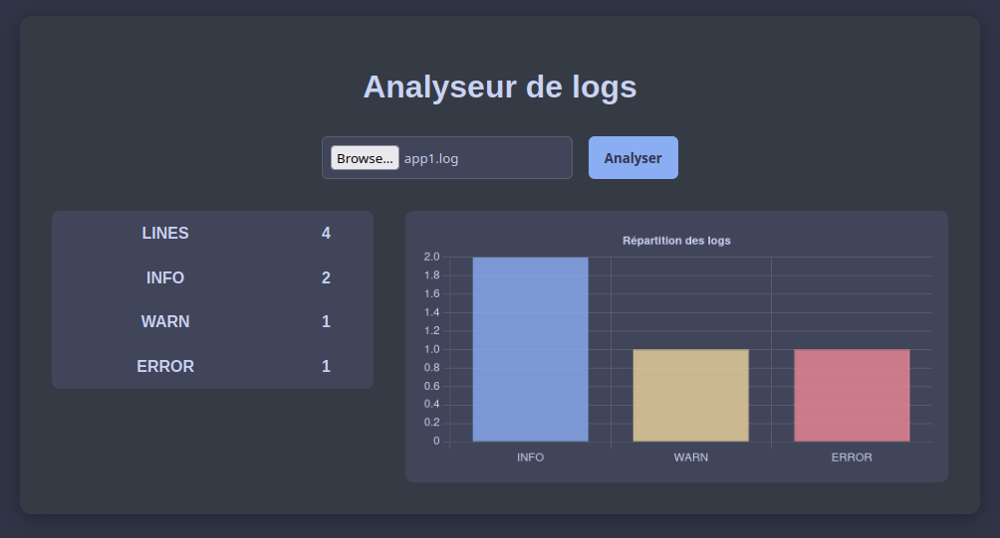

# Mini Logs Viewer

<p align="center">
  
</p>

## Install

```sh
python3 -m venv .venv
source .venv/bin/activate
python3 -m pip install -r backend/requirements.txt
```

## Run

### Backend

```sh
python3 -m uvicorn backend.app:app --reload
```

### Frontend

```sh
python3 -m http.server 3000 --directory frontend
```

## Run tests

```sh
python3 -m pytest
```
